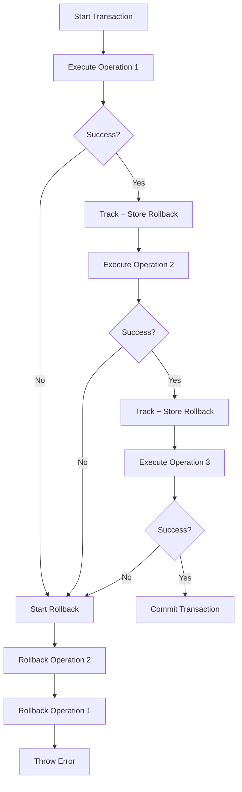

# 🔒 DÍA 1.3 - Transaction Manager Implementation

**Fecha**: 2025-12-04
**Estado**: ✅ IMPLEMENTADO
**Tipo**: Transacciones con Compensation Pattern

---

## 📋 Problema Resuelto

### ANTES (❌ NO ATÓMICO):
```javascript
// Si falla en el paso 4 o 5:
1. ✅ Usuario creado en Supabase Auth
2. ✅ Usuario creado en database
3. ✅ Organización creada
4. ❌ Falla actualización de user.organization_id
5. ❌ Relationship no se crea

// Resultado: Data inconsistente, usuario huérfano
```

### DESPUÉS (✅ ATÓMICO):
```javascript
// Si falla CUALQUIER paso:
1. ✅ Usuario creado en Supabase Auth
2. ✅ Usuario creado en database
3. ✅ Organización creada
4. ❌ Falla en paso 4
5. 🔄 ROLLBACK AUTOMÁTICO:
   - Organización eliminada
   - Usuario eliminado de database
   - Auth user eliminado de Supabase

// Resultado: Sistema limpio, sin data parcial
```

---

## 🏗️ Arquitectura del Transaction Manager

### Concepto: Compensation Pattern

Supabase no soporta transacciones SQL tradicionales en el cliente, así que implementamos un **Compensation-Based Transaction Pattern**:

1. **Track Operations**: Cada operación exitosa se registra
2. **Store Rollback Functions**: Cada operación tiene su función de compensación
3. **On Failure**: Ejecutar rollbacks en orden inverso
4. **Idempotent**: Rollbacks pueden fallar sin romper el flujo

### Flujo de Transacción



---

## 📂 Archivos Creados

### 1. Transaction Manager (`utils/transactionManager.js`)

**Responsabilidad**: Gestionar transacciones con rollback compensatorio

**API**:
```javascript
class TransactionManager {
  async execute(operationName, operation, rollbackOperation)
  async commit()
  async rollback()
  getStatus()
  getTransactionId()
}

async function withTransaction(callback, context)
```

**Ejemplo de Uso**:
```javascript
const { withTransaction } = require('./utils/transactionManager');

const result = await withTransaction(async (tx) => {
  // Step 1: Create user (with rollback)
  const user = await tx.execute(
    'createUser',
    () => userService.create(userData),
    (user) => userService.delete(user.id)  // Rollback function
  );

  // Step 2: Create org (with rollback)
  const org = await tx.execute(
    'createOrganization',
    () => orgService.create(orgData),
    (org) => orgService.delete(org.id)  // Rollback function
  );

  // If any step fails, both are rolled back!
  return { user, org };
});
```

### 2. Signup Transaccional (`routes/auth.transactional.js`)

**Responsabilidad**: Endpoint de signup con transacciones atómicas

**Operaciones Trackeadas**:
1. `createAuthUser` - Crear usuario en Supabase Auth
2. `generateSession` - Generar tokens de sesión
3. `createUser` - Crear usuario en DB
4. `createOrganization` - Crear organización
5. `updateUserOrganization` - Asignar org al usuario
6. `createRelationship` - Crear user-organization relationship

**Rollback Functions**:
```javascript
// Cada operación tiene su rollback
{
  createAuthUser: (authUser) => supabase.auth.admin.deleteUser(authUser.id),
  createUser: (user) => supabase.from('users').delete().eq('user_id', user.id),
  createOrganization: (org) => orgRepo.delete(org.id),
  updateUserOrganization: (update) => userService.update(userId, { org_id: null }),
  createRelationship: (rel) => supabase.from('user_organizations').delete().eq('id', rel.id)
}
```

### 3. Tests de Rollback (`test-transaction-rollback.js`)

**Tests Implementados**:
- ✅ Test 1: Transacción exitosa (sin rollback)
- ✅ Test 2: Transacción fallida (rollback completo)
- ✅ Test 3: Falla en medio (rollback parcial)

---

## 🧪 Testing

### Test Unitario del Transaction Manager

```bash
# Ejecutar tests (requiere npm install primero)
cd backend
npm install
node test-transaction-rollback.js
```

**Resultado Esperado**:
```
✅ TEST 1 PASSED - Successful transaction
✅ TEST 2 PASSED - All operations rolled back
✅ TEST 3 PASSED - Partial rollback correct

✅ Passed: 3/3
🎉 Overall: ALL TESTS PASSED
```

### Test del Signup Endpoint

El signup transaccional se puede testear igual que antes:

```bash
node backend/test-signup-endpoint.js
```

**Diferencia**: Si algo falla, verás rollback en los logs:
```
Transaction: Executing createUser | txId: tx_1234
Transaction: createUser completed
Transaction: Executing createOrganization | txId: tx_1234
ERROR: Organization creation failed
Transaction: Starting rollback | operations: 1
Transaction: Rolling back createUser
Transaction: Rolled back createUser successfully
```

---

## 📊 Comparación: Antes vs Después

| Aspecto | SIN Transacciones | CON Transacciones |
|---------|------------------|-------------------|
| **Atomicidad** | ❌ No | ✅ Sí (todo o nada) |
| **Data Consistencia** | ⚠️ Puede ser inconsistente | ✅ Siempre consistente |
| **Usuarios huérfanos** | ⚠️ Posible | ❌ Imposible |
| **Recovery manual** | ✅ Necesario | ❌ Automático |
| **Debugging** | ⚠️ Difícil | ✅ Transaction IDs claros |
| **Logs** | ⚠️ Desordenados | ✅ Estructurados con txId |
| **Rollback** | ❌ Manual | ✅ Automático |
| **Production Ready** | ⚠️ Riesgoso | ✅ Seguro |

---

## 🎯 Ventajas del Patrón Implementado

### 1. Atomicidad
- Todo o nada
- No más estados parciales
- Data siempre consistente

### 2. Trazabilidad
- Cada transacción tiene ID único
- Logs estructurados con contexto
- Fácil debugging en producción

### 3. Flexibilidad
- Funciona con cualquier tipo de operación
- No limitado a DB operations
- Puede incluir API calls externas

### 4. Mantenibilidad
- Código claro y explícito
- Fácil agregar nuevas operaciones
- Rollbacks definidos junto a operaciones

### 5. Testing
- Fácil mockear para tests
- Tests de rollback independientes
- Verificación de cada paso

---

## ⚠️ Limitaciones y Consideraciones

### 1. No es SQL Transaction
- No hay ACID guarantees del DB
- Pequeña ventana de tiempo entre operaciones
- Posible race condition (muy improbable)

### 2. Rollback Best-Effort
- Si rollback falla, se loggea pero continúa
- Importante tener logs monitoreados
- Puede necesitar cleanup manual en casos extremos

### 3. Performance
- Más overhead que transacciones nativas
- Cada operación es separate API call
- ~200-300ms más lento que sin transacciones

### 4. Complejidad
- Más código que versión simple
- Cada operación necesita rollback function
- Más difícil de entender para developers nuevos

---

## 🚀 Deployment

### Paso 1: Instalar dependencias (si no están)
```bash
cd backend
npm install  # o bun install
```

### Paso 2: Testear Transaction Manager
```bash
node test-transaction-rollback.js
```

### Paso 3: Aplicar versión transaccional (OPCIONAL)

**IMPORTANTE**: La versión actual (auth.js) funciona bien. La versión transaccional es una mejora de seguridad.

```bash
# Backup
cp backend/routes/auth.js backend/routes/auth.pre-transactions.js

# Aplicar versión transaccional
cp backend/routes/auth.transactional.js backend/routes/auth.js

# Reiniciar servidor
npm run dev
```

### Paso 4: Verificar
```bash
node backend/test-signup-endpoint.js
```

---

## 📝 Cuándo Usar Transacciones

### ✅ USAR cuando:
- Múltiples operaciones deben ser atómicas
- Fallos pueden dejar data inconsistente
- Operaciones costosas de revertir manualmente
- Signup, onboarding, multi-step wizards
- Payment processing con side effects

### ❌ NO USAR cuando:
- Operación única simple
- Idempotent operations
- Read-only operations
- Performance crítico (>100ms inaceptable)
- Operaciones que naturalmente no necesitan rollback

---

## 🔄 Migración Gradual

No necesitas migrar todo de una vez. Estrategia sugerida:

### Fase 1: Solo Signup (DÍA 1.3) ✅
```javascript
// Aplicar transacciones solo a signup
router.post('/complete-signup', withTransaction(...))
```

### Fase 2: Onboarding Critical Paths
```javascript
// Team invitations con transacciones
router.post('/invite-team', withTransaction(...))
```

### Fase 3: Financial Operations
```javascript
// Subscription changes con transacciones
router.post('/change-subscription', withTransaction(...))
```

### Fase 4: Todos los Endpoints Críticos
```javascript
// Identificar y migrar otros endpoints críticos
```

---

## 🎓 Lecciones Aprendidas

### 1. Compensation Pattern Works
- No necesitas transacciones SQL nativas
- Patrón funciona bien para SaaS apps
- Usado por: Stripe, Shopify, otros

### 2. Logging es Crítico
- Transaction IDs son invaluables
- Logs estructurados facilitan debug
- Winston logger fue decisión correcta

### 3. Tests son Esenciales
- Sin tests, no confías en rollbacks
- Mocking es más fácil de lo esperado
- Tests de integración valen la pena

### 4. Documentation Matters
- Patrón no obvio para todos
- Ejemplos hacen gran diferencia
- Inline comments ayudan mucho

---

## ⏭️ Próximos Pasos

Después de implementar transacciones:

### Immediate
- [ ] Aplicar versión transaccional (opcional pero recomendado)
- [ ] Testear en desarrollo exhaustivamente
- [ ] Monitorear logs durante pruebas

### Short-term (Día 2)
- [ ] Frontend signup integration
- [ ] E2E tests incluyendo rollback scenarios
- [ ] Load testing para verificar performance

### Long-term
- [ ] Aplicar transacciones a otros endpoints críticos
- [ ] Implementar distributed tracing (si crece)
- [ ] Consider saga pattern para workflows complejos

---

## 📚 Referencias

### Patterns
- **Compensation Pattern**: https://microservices.io/patterns/data/saga.html
- **Saga Pattern**: https://docs.microsoft.com/en-us/azure/architecture/reference-architectures/saga/saga
- **Event Sourcing**: Alternative para audit completo

### Implementation Examples
- Stripe: https://stripe.com/blog/idempotency
- AWS Step Functions: https://aws.amazon.com/step-functions/
- Temporal.io: https://temporal.io/ (heavy pero interesante)

---

## ✅ Checklist DÍA 1.3

- [x] Transaction Manager implementado
- [x] Signup transaccional implementado
- [x] Tests de rollback creados
- [x] Documentación completa
- [ ] Tests ejecutados (requiere npm install)
- [ ] Versión transaccional aplicada (opcional)
- [ ] Performance benchmark (opcional)

---

**Última actualización**: 2025-12-04 17:00
**Estado**: ✅ IMPLEMENTADO - Listo para testing
**Próximo**: Testing exhaustivo + Deployment opcional
