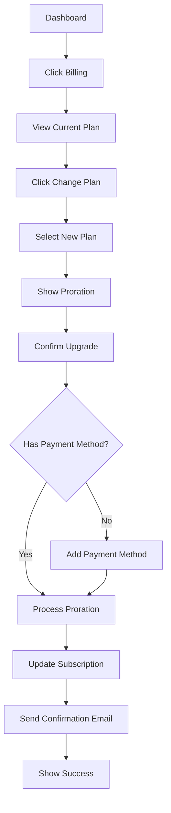
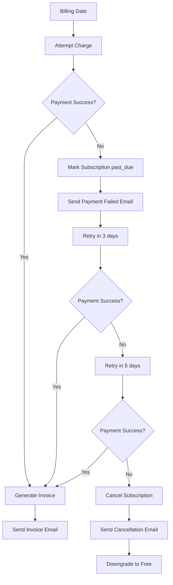
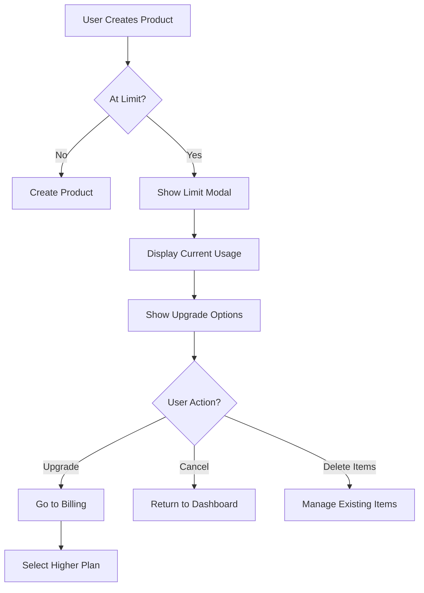

# PRD: Sistema de Suscripciones y Billing para Betali SaaS

> **Version**: 1.0
> **Date**: 2025-11-05
> **Status**: Planning
> **Priority**: 🔥 **CRITICAL** - Blocker para monetización

---

## 📋 Table of Contents

- [Executive Summary](#executive-summary)
- [Problem Statement](#problem-statement)
- [Goals & Success Metrics](#goals--success-metrics)
- [Subscription Plans](#subscription-plans)
- [Architecture Overview](#architecture-overview)
- [Database Schema](#database-schema)
- [Implementation Phases](#implementation-phases)
- [Technical Specifications](#technical-specifications)
- [User Flows](#user-flows)
- [Security & Compliance](#security--compliance)
- [Testing Strategy](#testing-strategy)

---

## 🎯 Executive Summary

Betali necesita implementar un **sistema completo de suscripciones y billing** para monetizar la plataforma SaaS. Este PRD detalla la implementación de planes de precios, integración con pasarelas de pago (MercadoPago + Stripe), enforcement de límites por plan, y gestión completa del ciclo de vida de suscripciones.

### **Current State**
- ✅ Multi-tenant architecture implementada
- ✅ Campos `subscription_plan` y `subscription_status` en DB
- ✅ MercadoPago SDK instalado en backend
- ⚠️ Página de pricing pública (frontend solamente, sin lógica)
- ❌ **NO HAY** integración con pasarelas de pago
- ❌ **NO HAY** enforcement de límites
- ❌ **NO HAY** gestión de suscripciones
- ❌ **NO HAY** facturación

### **Target State**
- ✅ Sistema de planes con límites enforcement
- ✅ Integración completa MercadoPago + Stripe
- ✅ Ciclo de vida de suscripciones automatizado
- ✅ Portal de facturación para clientes
- ✅ Trial periods y upgrades/downgrades
- ✅ Webhooks para eventos de pago

---

## 🔴 Problem Statement

**Para que Betali pueda generar ingresos como SaaS, necesitamos:**

1. **Definir y hacer cumplir límites por plan** - Actualmente cualquier organización puede crear recursos ilimitados
2. **Procesar pagos** - No hay forma de que los usuarios paguen
3. **Gestionar suscripciones** - No hay control sobre el ciclo de vida de suscripciones
4. **Facturar a clientes** - No hay generación ni almacenamiento de facturas
5. **Prevenir abuso** - Sin límites, usuarios pueden consumir recursos infinitos

### **Business Impact**
- 💰 **$0 MRR actual** - No podemos monetizar
- 🚫 **No podemos lanzar públicamente** sin sistema de pagos
- ⚠️ **Riesgo de abuso** sin límites por plan
- 📉 **No podemos trackear métricas SaaS** (MRR, churn, LTV)

---

## 🎯 Goals & Success Metrics

### **Primary Goals**
1. ✅ **Monetizar la plataforma** - Poder cobrar a clientes
2. ✅ **Controlar uso de recursos** - Límites por plan enforceados
3. ✅ **Automatizar facturación** - Cobros recurrentes sin intervención manual
4. ✅ **Mejorar UX de pago** - Proceso de checkout fluido

### **Success Metrics**

#### **Technical Metrics**
- ✅ **100% de transacciones exitosas registradas** en DB
- ✅ **< 2s latencia** en webhooks de pago
- ✅ **0 violaciones de límites** sin bloqueo
- ✅ **99.9% uptime** del sistema de billing

#### **Business Metrics**
- 📈 **>60% trial-to-paid conversion rate**
- 💳 **>95% successful payment rate**
- ⏱️ **<3 min tiempo promedio de checkout**
- 📊 **<5% monthly churn rate**

#### **User Experience Metrics**
- ⭐ **>4.5/5 satisfaction** con proceso de pago
- 🚀 **<5 clicks** desde ver pricing hasta confirmar pago
- 📧 **100% email delivery** para confirmaciones

---

## 💰 Subscription Plans

### **Plan Tiers**

| Feature | Free | Starter | Professional | Enterprise |
|---------|------|---------|--------------|------------|
| **Precio** | $0 | $29/mes | $79/mes | $199/mes |
| **Usuarios** | 1 | 3 | 10 | Ilimitado |
| **Productos** | 50 | 500 | 5,000 | Ilimitado |
| **Warehouses** | 1 | 2 | 10 | Ilimitado |
| **Stock Movements/mes** | 100 | 1,000 | 10,000 | Ilimitado |
| **Órdenes/mes** | 20 | 200 | 2,000 | Ilimitado |
| **Clientes** | 10 | 100 | 1,000 | Ilimitado |
| **Proveedores** | 5 | 50 | 500 | Ilimitado |
| **Storage (archivos)** | 100MB | 1GB | 10GB | 100GB |
| **Trial Period** | - | 14 días | 14 días | 30 días |
| **Soporte** | Email | Email | Prioritario | Dedicado |
| **API Access** | ❌ | ❌ | ✅ | ✅ |
| **Advanced Analytics** | ❌ | ❌ | ✅ | ✅ |
| **Custom Reports** | ❌ | ❌ | ✅ | ✅ |
| **Audit Logs** | ❌ | ❌ | ❌ | ✅ |
| **SSO** | ❌ | ❌ | ❌ | ✅ |
| **Custom Domain** | ❌ | ❌ | ❌ | ✅ |
| **SLA** | - | - | - | 99.9% |

### **Pricing Strategy**

#### **Payment Options**
- 💳 **Monthly billing**: Precio completo
- 💎 **Annual billing**: 20% descuento (2 meses gratis)
  - Starter: $279/año (vs $348)
  - Professional: $758/año (vs $948)
  - Enterprise: $1,910/año (vs $2,388)

#### **Supported Payment Methods**
- 🇦🇷 **MercadoPago** (Argentina/LATAM)
  - Tarjetas de crédito/débito
  - Transferencia bancaria
  - Efectivo (Rapipago, PagoFácil)
  - Billeteras digitales
- 🌎 **Stripe** (Internacional)
  - Credit/Debit cards
  - Apple Pay / Google Pay
  - Bank transfers (SEPA)
  - Alipay / WeChat Pay

#### **Upgrade/Downgrade Rules**
- ✅ **Upgrade**: Inmediato, prorratea el costo
- ⚠️ **Downgrade**: Al final del período actual
- 💰 **Proration**: Crédito disponible para próximo ciclo
- 🔄 **Grace period**: 7 días después de fallo de pago

---

## 🏗️ Architecture Overview

### **System Components**

```
┌─────────────────────────────────────────────────────────────┐
│                        Frontend Layer                        │
├─────────────────────────────────────────────────────────────┤
│  - Pricing Page (Public)                                     │
│  - Checkout Flow                                             │
│  - Billing Portal (Dashboard)                                │
│  - Usage Metrics Display                                     │
│  - Upgrade/Downgrade Modals                                  │
└─────────────────────────────────────────────────────────────┘
                              ↓
┌─────────────────────────────────────────────────────────────┐
│                       Backend API Layer                      │
├─────────────────────────────────────────────────────────────┤
│  - SubscriptionService                                       │
│  - BillingService                                            │
│  - PaymentGatewayService (MercadoPago + Stripe)             │
│  - LimitEnforcementMiddleware                               │
│  - WebhookHandlers                                           │
│  - InvoiceGenerator                                          │
└─────────────────────────────────────────────────────────────┘
                              ↓
┌───────────────────────────────────────────────────��─────────┐
│                      Database Layer (PostgreSQL)             │
├─────────────────────────────────────────────────────────────┤
│  - subscriptions                                             │
│  - subscription_plans                                        │
│  - organization_limits                                       │
│  - usage_tracking                                            │
│  - invoices                                                  │
│  - payment_transactions                                      │
│  - payment_methods                                           │
└─────────────────────────────────────────────────────────────┘
                              ↓
┌─────────────────────────────────────────────────────────────┐
│                    External Services                         │
├─────────────────────────────────────────────────────────────┤
│  - MercadoPago API                                           │
│  - Stripe API                                                │
│  - Email Service (SendGrid/Resend)                           │
│  - Analytics (Mixpanel/Posthog)                              │
└─────────────────────────────────────────────────────────────┘
```

---

## 🗄️ Database Schema

### **New Tables**

#### **1. subscription_plans**
```sql
CREATE TABLE subscription_plans (
  plan_id UUID PRIMARY KEY DEFAULT uuid_generate_v4(),

  -- Plan Info
  name VARCHAR(50) NOT NULL UNIQUE, -- 'free', 'starter', 'professional', 'enterprise'
  display_name VARCHAR(100) NOT NULL,
  description TEXT,

  -- Pricing
  price_monthly DECIMAL(10,2) NOT NULL DEFAULT 0,
  price_yearly DECIMAL(10,2) NOT NULL DEFAULT 0,
  currency VARCHAR(3) NOT NULL DEFAULT 'USD',

  -- Limits
  max_users INTEGER,
  max_products INTEGER,
  max_warehouses INTEGER,
  max_stock_movements_per_month INTEGER,
  max_orders_per_month INTEGER,
  max_clients INTEGER,
  max_suppliers INTEGER,
  max_storage_mb INTEGER,

  -- Features (JSONB for flexibility)
  features JSONB DEFAULT '{}',
  -- Example: {
  --   "api_access": true,
  --   "advanced_analytics": true,
  --   "custom_reports": true,
  --   "audit_logs": false,
  --   "sso": false,
  --   "priority_support": true
  -- }

  -- Trial
  trial_days INTEGER DEFAULT 0,

  -- Status
  is_active BOOLEAN DEFAULT true,
  is_public BOOLEAN DEFAULT true, -- shown on pricing page
  sort_order INTEGER DEFAULT 0,

  -- Timestamps
  created_at TIMESTAMP DEFAULT NOW(),
  updated_at TIMESTAMP DEFAULT NOW()
);

-- Seed data
INSERT INTO subscription_plans (name, display_name, price_monthly, price_yearly, max_users, max_products, max_warehouses, max_stock_movements_per_month, max_orders_per_month, max_clients, max_suppliers, max_storage_mb, trial_days, features) VALUES
('free', 'Free', 0, 0, 1, 50, 1, 100, 20, 10, 5, 100, 0, '{"api_access": false, "advanced_analytics": false}'),
('starter', 'Starter', 29, 279, 3, 500, 2, 1000, 200, 100, 50, 1024, 14, '{"api_access": false, "advanced_analytics": false}'),
('professional', 'Professional', 79, 758, 10, 5000, 10, 10000, 2000, 1000, 500, 10240, 14, '{"api_access": true, "advanced_analytics": true, "custom_reports": true}'),
('enterprise', 'Enterprise', 199, 1910, -1, -1, -1, -1, -1, -1, -1, 102400, 30, '{"api_access": true, "advanced_analytics": true, "custom_reports": true, "audit_logs": true, "sso": true, "priority_support": true}');
```

#### **2. subscriptions**
```sql
CREATE TABLE subscriptions (
  subscription_id UUID PRIMARY KEY DEFAULT uuid_generate_v4(),

  -- Relations
  organization_id UUID NOT NULL REFERENCES organizations(organization_id) ON DELETE CASCADE,
  plan_id UUID NOT NULL REFERENCES subscription_plans(plan_id),

  -- Status
  status VARCHAR(20) NOT NULL DEFAULT 'active',
  -- 'trialing', 'active', 'past_due', 'canceled', 'paused'

  -- Billing
  billing_cycle VARCHAR(10) NOT NULL DEFAULT 'monthly', -- 'monthly', 'yearly'
  amount DECIMAL(10,2) NOT NULL,
  currency VARCHAR(3) NOT NULL DEFAULT 'USD',

  -- Dates
  trial_start TIMESTAMP,
  trial_end TIMESTAMP,
  current_period_start TIMESTAMP NOT NULL,
  current_period_end TIMESTAMP NOT NULL,
  canceled_at TIMESTAMP,
  ended_at TIMESTAMP,

  -- Payment Gateway
  payment_gateway VARCHAR(20) NOT NULL, -- 'mercadopago', 'stripe'
  gateway_subscription_id VARCHAR(255), -- External subscription ID
  gateway_customer_id VARCHAR(255),

  -- Metadata
  metadata JSONB DEFAULT '{}',

  -- Timestamps
  created_at TIMESTAMP DEFAULT NOW(),
  updated_at TIMESTAMP DEFAULT NOW(),

  UNIQUE(organization_id)
);

-- Index for performance
CREATE INDEX idx_subscriptions_organization ON subscriptions(organization_id);
CREATE INDEX idx_subscriptions_status ON subscriptions(status);
CREATE INDEX idx_subscriptions_period_end ON subscriptions(current_period_end);
```

#### **3. usage_tracking**
```sql
CREATE TABLE usage_tracking (
  usage_id UUID PRIMARY KEY DEFAULT uuid_generate_v4(),

  -- Relations
  organization_id UUID NOT NULL REFERENCES organizations(organization_id) ON DELETE CASCADE,

  -- Period (monthly tracking)
  period_start DATE NOT NULL,
  period_end DATE NOT NULL,

  -- Usage Counters
  users_count INTEGER DEFAULT 0,
  products_count INTEGER DEFAULT 0,
  warehouses_count INTEGER DEFAULT 0,
  stock_movements_count INTEGER DEFAULT 0,
  orders_count INTEGER DEFAULT 0,
  clients_count INTEGER DEFAULT 0,
  suppliers_count INTEGER DEFAULT 0,
  storage_used_mb INTEGER DEFAULT 0,

  -- API Usage (for future)
  api_calls_count INTEGER DEFAULT 0,

  -- Timestamps
  created_at TIMESTAMP DEFAULT NOW(),
  updated_at TIMESTAMP DEFAULT NOW(),

  UNIQUE(organization_id, period_start)
);

CREATE INDEX idx_usage_organization_period ON usage_tracking(organization_id, period_start);
```

#### **4. invoices**
```sql
CREATE TABLE invoices (
  invoice_id UUID PRIMARY KEY DEFAULT uuid_generate_v4(),

  -- Relations
  organization_id UUID NOT NULL REFERENCES organizations(organization_id) ON DELETE CASCADE,
  subscription_id UUID REFERENCES subscriptions(subscription_id) ON DELETE SET NULL,

  -- Invoice Info
  invoice_number VARCHAR(50) NOT NULL UNIQUE,
  status VARCHAR(20) NOT NULL DEFAULT 'draft',
  -- 'draft', 'pending', 'paid', 'failed', 'refunded', 'void'

  -- Amounts
  subtotal DECIMAL(10,2) NOT NULL,
  tax_amount DECIMAL(10,2) DEFAULT 0,
  discount_amount DECIMAL(10,2) DEFAULT 0,
  total DECIMAL(10,2) NOT NULL,
  currency VARCHAR(3) NOT NULL DEFAULT 'USD',

  -- Billing Info
  billing_name VARCHAR(255) NOT NULL,
  billing_email VARCHAR(255) NOT NULL,
  billing_address TEXT,
  tax_id VARCHAR(50), -- CUIT/RFC/VAT

  -- Dates
  invoice_date DATE NOT NULL,
  due_date DATE NOT NULL,
  paid_at TIMESTAMP,

  -- Payment
  payment_gateway VARCHAR(20),
  gateway_payment_id VARCHAR(255),
  payment_method VARCHAR(50), -- 'credit_card', 'debit_card', 'bank_transfer', etc

  -- PDF
  pdf_url TEXT,

  -- Line Items (JSONB)
  line_items JSONB DEFAULT '[]',
  -- Example: [{
  --   "description": "Professional Plan - Monthly",
  --   "quantity": 1,
  --   "unit_price": 79.00,
  --   "total": 79.00
  -- }]

  -- Metadata
  metadata JSONB DEFAULT '{}',

  -- Timestamps
  created_at TIMESTAMP DEFAULT NOW(),
  updated_at TIMESTAMP DEFAULT NOW()
);

CREATE INDEX idx_invoices_organization ON invoices(organization_id);
CREATE INDEX idx_invoices_status ON invoices(status);
CREATE INDEX idx_invoices_date ON invoices(invoice_date DESC);
```

#### **5. payment_transactions**
```sql
CREATE TABLE payment_transactions (
  transaction_id UUID PRIMARY KEY DEFAULT uuid_generate_v4(),

  -- Relations
  organization_id UUID NOT NULL REFERENCES organizations(organization_id) ON DELETE CASCADE,
  subscription_id UUID REFERENCES subscriptions(subscription_id) ON DELETE SET NULL,
  invoice_id UUID REFERENCES invoices(invoice_id) ON DELETE SET NULL,

  -- Transaction Info
  amount DECIMAL(10,2) NOT NULL,
  currency VARCHAR(3) NOT NULL DEFAULT 'USD',
  status VARCHAR(20) NOT NULL,
  -- 'pending', 'processing', 'succeeded', 'failed', 'refunded', 'canceled'

  -- Payment Gateway
  payment_gateway VARCHAR(20) NOT NULL,
  gateway_transaction_id VARCHAR(255) NOT NULL,
  gateway_customer_id VARCHAR(255),

  -- Payment Method
  payment_method_type VARCHAR(50), -- 'credit_card', 'debit_card', 'bank_transfer'
  card_brand VARCHAR(20), -- 'visa', 'mastercard', 'amex'
  card_last4 VARCHAR(4),

  -- Error Info
  error_code VARCHAR(50),
  error_message TEXT,

  -- Timestamps
  gateway_created_at TIMESTAMP,
  processed_at TIMESTAMP,
  created_at TIMESTAMP DEFAULT NOW(),
  updated_at TIMESTAMP DEFAULT NOW()
);

CREATE INDEX idx_transactions_organization ON payment_transactions(organization_id);
CREATE INDEX idx_transactions_status ON payment_transactions(status);
CREATE INDEX idx_transactions_gateway ON payment_transactions(payment_gateway, gateway_transaction_id);
```

#### **6. payment_methods**
```sql
CREATE TABLE payment_methods (
  payment_method_id UUID PRIMARY KEY DEFAULT uuid_generate_v4(),

  -- Relations
  organization_id UUID NOT NULL REFERENCES organizations(organization_id) ON DELETE CASCADE,

  -- Payment Gateway
  payment_gateway VARCHAR(20) NOT NULL,
  gateway_payment_method_id VARCHAR(255) NOT NULL,
  gateway_customer_id VARCHAR(255),

  -- Card Info (if applicable)
  type VARCHAR(50) NOT NULL, -- 'card', 'bank_account', 'digital_wallet'
  card_brand VARCHAR(20),
  card_last4 VARCHAR(4),
  card_exp_month INTEGER,
  card_exp_year INTEGER,

  -- Bank Account Info (if applicable)
  bank_name VARCHAR(100),
  bank_account_last4 VARCHAR(4),

  -- Status
  is_default BOOLEAN DEFAULT false,
  is_active BOOLEAN DEFAULT true,

  -- Timestamps
  created_at TIMESTAMP DEFAULT NOW(),
  updated_at TIMESTAMP DEFAULT NOW()
);

CREATE INDEX idx_payment_methods_organization ON payment_methods(organization_id);
CREATE INDEX idx_payment_methods_default ON payment_methods(organization_id, is_default) WHERE is_default = true;
```

### **Modified Tables**

#### **organizations** (update existing)
```sql
-- Add new columns
ALTER TABLE organizations ADD COLUMN IF NOT EXISTS subscription_plan VARCHAR(50) DEFAULT 'free';
ALTER TABLE organizations ADD COLUMN IF NOT EXISTS subscription_status VARCHAR(20) DEFAULT 'active';
ALTER TABLE organizations ADD COLUMN IF NOT EXISTS trial_ends_at TIMESTAMP;
ALTER TABLE organizations ADD COLUMN IF NOT EXISTS grace_period_ends_at TIMESTAMP;

-- Add foreign key to subscription_plans (optional, for data integrity)
ALTER TABLE organizations ADD CONSTRAINT fk_organizations_plan
  FOREIGN KEY (subscription_plan) REFERENCES subscription_plans(name) ON UPDATE CASCADE;
```

---

## 🛠️ Implementation Phases

### **Phase 1: Foundation & Plan Management** (Week 1)
**Goal**: Setup plan structure and database

#### Backend Tasks
- [ ] Create database migration for all new tables
- [ ] Create `SubscriptionPlanRepository.js`
- [ ] Create `SubscriptionPlanService.js`
- [ ] Create `SubscriptionPlanController.js`
- [ ] Add routes: `GET /api/subscription-plans` (public)
- [ ] Seed initial plan data
- [ ] Create `LimitEnforcementMiddleware.js`
- [ ] Add helper functions for limit checking

#### Frontend Tasks
- [ ] Create `subscriptionService.ts` API client
- [ ] Create `useSubscriptionPlans()` hook
- [ ] Update existing pricing page to fetch real plan data
- [ ] Create `PlanCard` component with features list
- [ ] Add "Current Plan" badge in billing section

#### Testing
- [ ] Unit tests for plan service
- [ ] Integration tests for plan endpoints

---

### **Phase 2: Usage Tracking & Limit Enforcement** (Week 1-2)
**Goal**: Track usage and enforce limits

#### Backend Tasks
- [ ] Create `UsageTrackingService.js`
- [ ] Implement usage tracking hooks in:
  - [ ] UserService (track user count)
  - [ ] ProductService (track product count)
  - [ ] WarehouseService (track warehouse count)
  - [ ] StockMovementService (track movements)
  - [ ] OrderService (track orders)
  - [ ] ClientService (track clients)
  - [ ] SupplierService (track suppliers)
- [ ] Create `checkOrganizationLimit()` middleware
- [ ] Apply middleware to protected endpoints:
  ```javascript
  router.post('/products',
    auth,
    checkOrganizationLimit('products'),
    productController.create
  );
  ```
- [ ] Create daily cron job to reset monthly counters
- [ ] Create usage aggregation queries

#### Frontend Tasks
- [ ] Create `UsageMetrics` component for dashboard
- [ ] Show usage bars: "15 / 50 products"
- [ ] Add "Upgrade" CTA when approaching limits
- [ ] Create `LimitReachedModal` component
- [ ] Handle 403 errors with limit upgrade prompts

#### Testing
- [ ] Test limit enforcement on each resource
- [ ] Test usage counter increments
- [ ] Test limit reached scenarios
- [ ] Load testing for high-volume usage

---

### **Phase 3: MercadoPago Integration** (Week 2)
**Goal**: Enable payments for LATAM customers

#### Backend Tasks
- [ ] Create `MercadoPagoService.js`
  - [ ] `createPreference()` - Generate checkout URL
  - [ ] `createSubscription()` - Recurring payments
  - [ ] `getPaymentInfo()`
  - [ ] `refundPayment()`
- [ ] Create `PaymentGatewayService.js` (abstraction layer)
- [ ] Create webhook endpoint: `POST /api/webhooks/mercadopago`
- [ ] Implement webhook signature verification
- [ ] Handle webhook events:
  - [ ] `payment.created`
  - [ ] `payment.updated`
  - [ ] `subscription.updated`
  - [ ] `subscription.cancelled`
- [ ] Create `SubscriptionService.js`
  - [ ] `createSubscription()`
  - [ ] `updateSubscription()`
  - [ ] `cancelSubscription()`
  - [ ] `resumeSubscription()`
- [ ] Update organization subscription status on payment events

#### Frontend Tasks
- [ ] Create `CheckoutPage.tsx`
- [ ] Integrate MercadoPago checkout button
- [ ] Create `PaymentSuccess.tsx` page
- [ ] Create `PaymentFailed.tsx` page
- [ ] Handle redirect flow after payment
- [ ] Add loading states during payment processing

#### Testing
- [ ] Test MercadoPago sandbox environment
- [ ] Test webhook handling with ngrok/localtunnel
- [ ] Test subscription creation flow
- [ ] Test payment failure scenarios

---

### **Phase 4: Stripe Integration** (Week 3)
**Goal**: Enable payments for international customers

#### Backend Tasks
- [ ] Install Stripe SDK: `npm install stripe`
- [ ] Create `StripeService.js`
  - [ ] `createCustomer()`
  - [ ] `createCheckoutSession()`
  - [ ] `createSubscription()`
  - [ ] `updateSubscription()`
  - [ ] `cancelSubscription()`
  - [ ] `getInvoices()`
- [ ] Create webhook endpoint: `POST /api/webhooks/stripe`
- [ ] Implement webhook signature verification
- [ ] Handle webhook events:
  - [ ] `checkout.session.completed`
  - [ ] `invoice.payment_succeeded`
  - [ ] `invoice.payment_failed`
  - [ ] `customer.subscription.updated`
  - [ ] `customer.subscription.deleted`

#### Frontend Tasks
- [ ] Create Stripe checkout integration
- [ ] Add payment method selector (MercadoPago vs Stripe)
- [ ] Create `StripeCheckoutForm` component
- [ ] Handle 3D Secure authentication

#### Testing
- [ ] Test Stripe test mode
- [ ] Test webhook events
- [ ] Test international cards
- [ ] Test 3D Secure flow

---

### **Phase 5: Billing Portal** (Week 3-4)
**Goal**: Self-service billing management

#### Backend Tasks
- [ ] Create `InvoiceService.js`
  - [ ] `generateInvoice()`
  - [ ] `generateInvoicePDF()`
  - [ ] `sendInvoiceEmail()`
- [ ] Create `BillingController.js`
- [ ] Add routes:
  - [ ] `GET /api/billing/subscription` - Current subscription
  - [ ] `GET /api/billing/invoices` - Invoice history
  - [ ] `GET /api/billing/invoices/:id/download` - Download PDF
  - [ ] `GET /api/billing/usage` - Current usage
  - [ ] `POST /api/billing/payment-methods` - Add payment method
  - [ ] `DELETE /api/billing/payment-methods/:id` - Remove
  - [ ] `PUT /api/billing/subscription/plan` - Change plan
  - [ ] `DELETE /api/billing/subscription` - Cancel subscription

#### Frontend Tasks
- [ ] Create `BillingPage.tsx` in dashboard
- [ ] Create `CurrentSubscription` component
  - [ ] Show current plan
  - [ ] Show next billing date
  - [ ] Show payment method
  - [ ] "Change Plan" button
  - [ ] "Cancel Subscription" button
- [ ] Create `InvoiceHistory` component
  - [ ] Table with invoice list
  - [ ] Download PDF button
  - [ ] Payment status badges
- [ ] Create `UsageDashboard` component
  - [ ] Progress bars for each limit
  - [ ] "Upgrade" CTAs
- [ ] Create `PaymentMethods` component
  - [ ] List saved payment methods
  - [ ] Add/remove cards
  - [ ] Set default method
- [ ] Create `ChangePlanModal` component
  - [ ] Show current vs new plan
  - [ ] Calculate proration
  - [ ] Confirm upgrade/downgrade
- [ ] Create `CancelSubscriptionModal` component
  - [ ] Feedback form (why canceling?)
  - [ ] Retention offers
  - [ ] Confirm cancellation

#### Testing
- [ ] Test plan upgrades with proration
- [ ] Test plan downgrades
- [ ] Test subscription cancellation
- [ ] Test invoice generation
- [ ] Test PDF generation

---

### **Phase 6: Email Notifications** (Week 4)
**Goal**: Automated email communication

#### Backend Tasks
- [ ] Choose email provider (SendGrid/Resend/AWS SES)
- [ ] Create `EmailService.js`
  - [ ] `sendWelcomeEmail()`
  - [ ] `sendTrialStartEmail()`
  - [ ] `sendTrialEndingEmail()` (3 days before)
  - [ ] `sendPaymentSuccessEmail()`
  - [ ] `sendPaymentFailedEmail()`
  - [ ] `sendInvoiceEmail()`
  - [ ] `sendSubscriptionCanceledEmail()`
  - [ ] `sendLimitApproachingEmail()` (80% usage)
- [ ] Create email templates (HTML + text)
- [ ] Integrate email service with subscription events
- [ ] Create cron jobs:
  - [ ] Daily: Check trial expiring soon
  - [ ] Daily: Check usage limits approaching
  - [ ] Daily: Retry failed payments

#### Frontend Tasks
- [ ] Create email preference settings
- [ ] Allow users to opt-in/out of marketing emails

#### Testing
- [ ] Test all email templates
- [ ] Test email delivery
- [ ] Test unsubscribe links

---

### **Phase 7: Trial Period Management** (Week 4)
**Goal**: Automated trial handling

#### Backend Tasks
- [ ] Create `TrialService.js`
  - [ ] `startTrial()` - Called on signup
  - [ ] `extendTrial()` - Manual extension
  - [ ] `endTrial()` - Convert to paid or downgrade
- [ ] Create trial expiration cron job (runs daily)
- [ ] Implement trial grace period (7 days)
- [ ] Auto-downgrade to free plan after grace period

#### Frontend Tasks
- [ ] Show trial countdown in dashboard header
- [ ] Create `TrialBanner` component
- [ ] Show "Upgrade Now" CTAs during trial
- [ ] Create `TrialExpiredModal` component

#### Testing
- [ ] Test trial start on signup
- [ ] Test trial expiration flow
- [ ] Test grace period behavior
- [ ] Test auto-downgrade to free

---

### **Phase 8: Analytics & Monitoring** (Week 5)
**Goal**: Track business metrics

#### Backend Tasks
- [ ] Create `AnalyticsService.js`
  - [ ] Track MRR (Monthly Recurring Revenue)
  - [ ] Track churn rate
  - [ ] Track trial conversion rate
  - [ ] Track ARPU (Average Revenue Per User)
- [ ] Create admin dashboard endpoint:
  - [ ] `GET /api/admin/analytics/mrr`
  - [ ] `GET /api/admin/analytics/subscriptions`
  - [ ] `GET /api/admin/analytics/usage`
- [ ] Integrate with external analytics (Mixpanel/PostHog)

#### Frontend Tasks
- [ ] Create `AdminAnalytics.tsx` page (super_admin only)
- [ ] Charts for MRR, churn, conversions
- [ ] Subscription health dashboard

---

### **Phase 9: Testing & Polish** (Week 5-6)
**Goal**: Production-ready system

#### Tasks
- [ ] End-to-end testing of full subscription lifecycle
- [ ] Load testing payment webhooks
- [ ] Security audit of payment handling
- [ ] PCI compliance review
- [ ] GDPR compliance (data export, deletion)
- [ ] Performance optimization
- [ ] Error handling improvements
- [ ] Monitoring and alerting setup
- [ ] Documentation (API docs, user guides)
- [ ] Beta testing with real users

---

## 👥 User Flows

### **Flow 1: New User Signup → Trial → Paid**

```mermaid
graph TD
    A[Visit Pricing Page] --> B[Select Plan]
    B --> C[Click "Start Free Trial"]
    C --> D[Sign Up Form]
    D --> E[Create Account]
    E --> F[Auto-create Organization]
    F --> G[Start Trial - 14 days]
    G --> H[Use Product]

    H --> I{Trial Expiring?}
    I -->|3 days left| J[Email: Trial Ending Soon]
    J --> K{Add Payment Method?}
    K -->|Yes| L[Enter Card Details]
    L --> M[Convert to Paid]
    M --> N[Continue Using]

    K -->|No| O[Trial Expires]
    O --> P[Grace Period - 7 days]
    P --> Q{Add Payment?}
    Q -->|Yes| L
    Q -->|No| R[Downgrade to Free Plan]
    R --> S[Limited Access]
```

### **Flow 2: Upgrade Plan**



### **Flow 3: Payment Failure → Recovery**



### **Flow 4: Limit Reached → Upgrade**



---

## 🔒 Security & Compliance

### **Payment Security**

#### **PCI Compliance**
- ✅ **Never store card numbers** - Use tokenization
- ✅ **Use payment gateway SDKs** - Stripe Elements, MercadoPago SDK
- ✅ **Secure webhook endpoints** - Verify signatures
- ✅ **HTTPS only** for all payment flows
- ✅ **Encrypt sensitive data** at rest

#### **Webhook Security**
```javascript
// Example: Verify MercadoPago webhook signature
const verifyMercadoPagoSignature = (req) => {
  const xSignature = req.headers['x-signature'];
  const xRequestId = req.headers['x-request-id'];
  const dataID = req.query['data.id'];

  const hash = crypto
    .createHmac('sha256', process.env.MERCADOPAGO_WEBHOOK_SECRET)
    .update(`${xRequestId}${dataID}`)
    .digest('hex');

  return hash === xSignature;
};
```

### **GDPR Compliance**

#### **Data Privacy Requirements**
- ✅ **Right to access** - Users can download billing data
- ✅ **Right to deletion** - Delete payment history (keep financial records)
- ✅ **Data portability** - Export invoices and transactions
- ✅ **Consent management** - Marketing email opt-ins

#### **Data Retention**
- 💼 **Invoices**: 7 years (tax law requirement)
- 💳 **Payment transactions**: 7 years
- 📊 **Usage tracking**: 2 years
- 🗑️ **Canceled subscriptions**: Archive after 1 year

---

## 🧪 Testing Strategy

### **Unit Tests**

```javascript
// Example: Test limit enforcement
describe('LimitEnforcementMiddleware', () => {
  it('should allow creation when under limit', async () => {
    const org = { subscription_plan: 'starter' };
    const usage = { products_count: 100 };
    const limit = { max_products: 500 };

    const result = await checkLimit(org, 'products', usage, limit);
    expect(result.allowed).toBe(true);
  });

  it('should block creation when at limit', async () => {
    const org = { subscription_plan: 'starter' };
    const usage = { products_count: 500 };
    const limit = { max_products: 500 };

    const result = await checkLimit(org, 'products', usage, limit);
    expect(result.allowed).toBe(false);
    expect(result.message).toContain('upgrade');
  });
});
```

### **Integration Tests**

```javascript
describe('Subscription Lifecycle', () => {
  it('should create trial subscription on signup', async () => {
    const user = await createUser({ email: 'test@test.com' });
    const org = await getOrganization(user.organization_id);

    expect(org.subscription_status).toBe('trialing');
    expect(org.trial_ends_at).toBeDefined();
  });

  it('should upgrade plan and calculate proration', async () => {
    const org = await upgradeSubscription(orgId, 'professional');

    expect(org.subscription_plan).toBe('professional');
    expect(org.subscription_status).toBe('active');
  });
});
```

### **E2E Tests** (Playwright/Cypress)

```javascript
test('Complete checkout flow', async ({ page }) => {
  // Visit pricing page
  await page.goto('/pricing');

  // Select plan
  await page.click('[data-plan="professional"]');

  // Fill signup form
  await page.fill('[name="email"]', 'test@example.com');
  await page.fill('[name="password"]', 'SecurePassword123!');
  await page.click('button[type="submit"]');

  // Verify trial started
  await expect(page.locator('.trial-banner')).toBeVisible();
  await expect(page.locator('.trial-banner')).toContainText('14 days left');

  // Go to billing
  await page.click('[href="/dashboard/billing"]');

  // Add payment method
  await page.click('button:has-text("Add Payment Method")');

  // Fill card details (test mode)
  await page.fill('[data-stripe="cardNumber"]', '4242424242424242');
  await page.fill('[data-stripe="cardExpiry"]', '12/25');
  await page.fill('[data-stripe="cardCvc"]', '123');
  await page.click('button:has-text("Save Card")');

  // Verify payment method added
  await expect(page.locator('.payment-method')).toContainText('Visa ****4242');
});
```

### **Load Tests** (k6)

```javascript
import http from 'k6/http';
import { check } from 'k6';

export const options = {
  stages: [
    { duration: '1m', target: 50 },  // Ramp up to 50 users
    { duration: '3m', target: 50 },  // Stay at 50 users
    { duration: '1m', target: 0 },   // Ramp down
  ],
};

export default function () {
  // Test webhook endpoint
  const payload = JSON.stringify({
    id: 12345,
    type: 'payment',
    data: { id: '67890' }
  });

  const params = {
    headers: {
      'Content-Type': 'application/json',
      'x-signature': 'valid-signature',
    },
  };

  const res = http.post('http://localhost:4000/api/webhooks/mercadopago', payload, params);

  check(res, {
    'status is 200': (r) => r.status === 200,
    'response time < 500ms': (r) => r.timings.duration < 500,
  });
}
```

---

## 📊 Monitoring & Alerts

### **Key Metrics to Monitor**

#### **Business Metrics**
- 💰 **MRR (Monthly Recurring Revenue)** - Total recurring revenue
- 📈 **MRR Growth Rate** - Month-over-month growth
- 👥 **Active Subscriptions** - Count by plan
- 🔄 **Churn Rate** - Cancellations / Active subscriptions
- 💎 **Trial Conversion Rate** - Trials → Paid
- 💵 **ARPU** - Average revenue per user
- 📉 **Failed Payment Rate** - Failed charges / Total charges

#### **Technical Metrics**
- ⚡ **Webhook Processing Time** - p50, p95, p99
- ❌ **Webhook Failure Rate** - Failed webhooks / Total
- 💳 **Payment Success Rate** - Successful charges / Total
- 🔄 **API Response Times** - /billing endpoints
- 🚨 **Error Rate** - 5xx errors in billing system

### **Alerts to Setup**

```yaml
# Example: Datadog/Prometheus alerts

- name: High Failed Payment Rate
  condition: failed_payments_rate > 10%
  window: 1 hour
  severity: critical
  notify: billing-team@betali.com

- name: Webhook Processing Slow
  condition: webhook_p95_latency > 2000ms
  window: 5 minutes
  severity: warning

- name: MRR Drop
  condition: mrr < previous_month_mrr * 0.95
  window: 1 day
  severity: critical
  notify: founders@betali.com
```

---

## 📝 Implementation Checklist

### **Pre-Launch Checklist**

#### **Backend**
- [ ] All database migrations tested
- [ ] MercadoPago integration tested in production
- [ ] Stripe integration tested in production
- [ ] Webhook endpoints secured and tested
- [ ] Email service configured and tested
- [ ] Cron jobs scheduled and tested
- [ ] Error monitoring configured (Sentry)
- [ ] Logging configured (CloudWatch/Datadog)

#### **Frontend**
- [ ] Pricing page live and accurate
- [ ] Checkout flow tested end-to-end
- [ ] Billing portal functional
- [ ] Usage metrics displaying correctly
- [ ] Limit enforcement tested
- [ ] Error handling for payment failures
- [ ] Loading states for all async operations

#### **Legal & Compliance**
- [ ] Terms of Service updated
- [ ] Privacy Policy updated (mention payment processors)
- [ ] Refund policy defined
- [ ] GDPR data export implemented
- [ ] PCI compliance verified

#### **Testing**
- [ ] All unit tests passing
- [ ] All integration tests passing
- [ ] E2E tests passing
- [ ] Load tests show acceptable performance
- [ ] Security audit completed

#### **Documentation**
- [ ] API documentation for billing endpoints
- [ ] User guide for billing portal
- [ ] Admin guide for subscription management
- [ ] Webhook documentation for integrators
- [ ] FAQ for common billing questions

#### **Monitoring**
- [ ] Business metrics dashboard
- [ ] Technical metrics dashboard
- [ ] Alerts configured and tested
- [ ] On-call rotation for billing issues

---

## 🚀 Go-Live Plan

### **Soft Launch** (Week 6)
- 🧪 **Beta users only** (10-20 users)
- 🎟️ **Invite-only** access to paid plans
- 👀 **Monitor closely** for issues
- 📊 **Collect feedback** on billing UX

### **Public Launch** (Week 7)
- 🌎 **Open to all** new signups
- 📣 **Marketing campaign** launch
- 💰 **Free plan available** to reduce friction
- 🎁 **Launch discount**: 20% off first 3 months

### **Post-Launch** (Week 8+)
- 📈 **Monitor KPIs** daily
- 🐛 **Fix issues** quickly
- 💬 **Gather user feedback**
- 🔄 **Iterate on features**

---

## 🎯 Success Criteria

### **MVP Definition of Done**

✅ **Must Have (Launch Blockers)**
- [ ] Users can sign up for trial
- [ ] Users can add payment method
- [ ] Users can upgrade/downgrade plans
- [ ] Automatic billing works correctly
- [ ] Webhooks process successfully
- [ ] Limits are enforced
- [ ] Invoices are generated
- [ ] Email notifications sent
- [ ] Zero data leakage between orgs

✅ **Should Have (Post-Launch)**
- [ ] Analytics dashboard for admins
- [ ] Proration calculations
- [ ] Grace period for failed payments
- [ ] Retention offers on cancellation
- [ ] Usage forecasting

✅ **Nice to Have (Future)**
- [ ] Annual billing discount automation
- [ ] Referral program
- [ ] Gift subscriptions
- [ ] Custom enterprise pricing
- [ ] White-label options

---

## 📚 Additional Resources

### **Payment Gateway Documentation**
- [MercadoPago API Docs](https://www.mercadopago.com.ar/developers/es/docs)
- [Stripe API Docs](https://stripe.com/docs/api)
- [Stripe Billing Quickstart](https://stripe.com/docs/billing/quickstart)

### **Inspiration & Best Practices**
- [Stripe Billing Best Practices](https://stripe.com/guides/billing-best-practices)
- [SaaS Metrics Guide](https://www.saastr.com/saas-metrics-2/)
- [PCI Compliance Checklist](https://www.pcisecuritystandards.org/)

### **Internal References**
- [SAAS_ARCHITECTURE.md](/SAAS_ARCHITECTURE.md) - Multi-tenant architecture
- [MVP_ROADMAP.md](/MVP_ROADMAP.md) - Overall product roadmap
- [PRD_ORGANIZATION_LIMITS.md](/PRD_ORGANIZATION_LIMITS.md) - Configurable limits

---

## 🤝 Stakeholders

**Product Owner**: Santiago Alaniz
**Tech Lead**: Backend Team
**Designer**: Frontend Team
**QA**: Testing Team

**Target Launch Date**: 6 weeks from kickoff
**Budget**: MercadoPago + Stripe fees (~3% per transaction)

---

**Next Steps**:
1. Review and approve this PRD
2. Create detailed tickets in project management tool
3. Assign Phase 1 tasks to team
4. Setup development/staging environment for payment gateways
5. Begin database migration work

---

**Questions or Feedback?** Contact: santiago@betali.com
