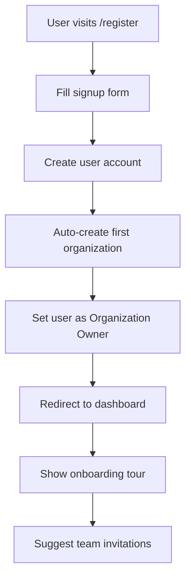
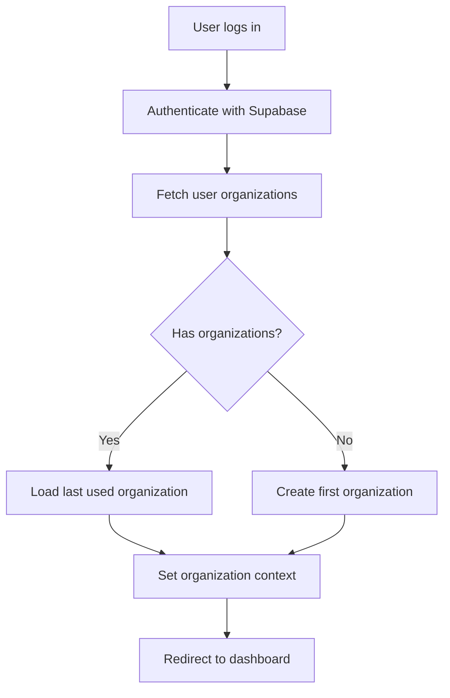
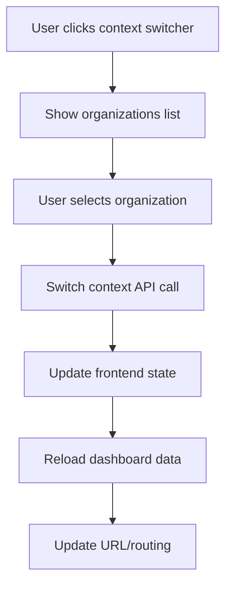
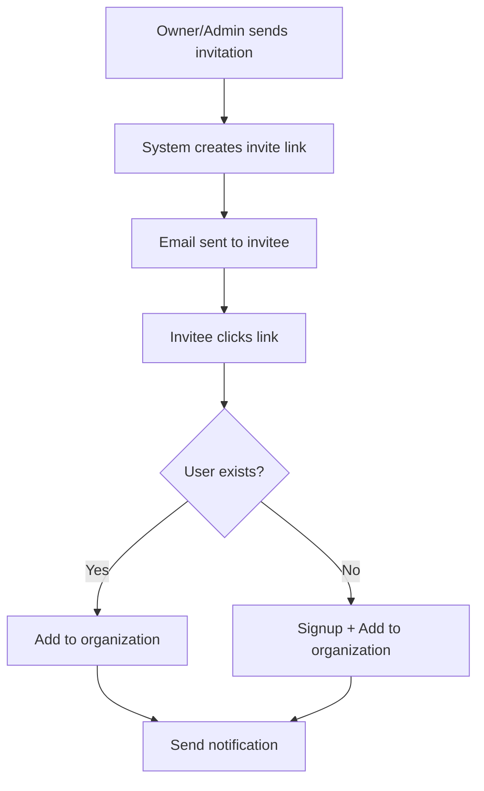

# 🏗️ Betali SaaS Multi-Tenant Architecture

> **Version**: 2.0  
> **Date**: 2025-08-12  
> **Status**: Implementation Phase  

## 📋 Table of Contents

- [Overview](#overview)
- [Architecture Principles](#architecture-principles)
- [User Flows](#user-flows)
- [Database Schema](#database-schema)
- [Role System](#role-system)
- [Authentication & Authorization](#authentication--authorization)
- [Implementation Plan](#implementation-plan)
- [Migration Strategy](#migration-strategy)

---

## 🎯 Overview

Betali is transitioning to a **self-service SaaS multi-tenant architecture** similar to Discord servers or Notion workspaces. This allows multiple independent organizations to use the platform while maintaining complete data isolation and role-based access control.

### **Key Design Decisions**

✅ **Self-Service Model**: Users can sign up and immediately create their organization  
✅ **Multi-Organization Support**: Users can belong to multiple organizations  
✅ **Automatic Onboarding**: First organization created automatically during signup  
✅ **Role-Based Access**: Granular permissions per organization  
✅ **Context Switching**: Easy switching between organizations  

---

## 🧩 Architecture Principles

### **1. Tenant Isolation**
- Each organization is a completely isolated tenant
- No cross-tenant data leakage
- Organization-scoped queries by default

### **2. User-Centric Design**
- Users exist globally across the platform
- Users can have different roles in different organizations
- Single authentication, multiple organization contexts

### **3. Self-Service Onboarding**
- Zero-friction signup process
- Automatic first organization creation
- Immediate productivity after signup

### **4. Scalable Role System**
- Hierarchical permissions
- Organization-specific roles
- Extensible permission framework

---

## 👥 User Flows

### **🆕 New User Signup**



**Steps:**
1. User fills registration form (name, email, password)
2. System creates user account in `users` table
3. System automatically creates first organization: `{user.name}'s Organization`
4. System creates `user_organizations` relationship with role `owner`
5. User is redirected to the new organization's dashboard
6. Optional: Onboarding tour and team invitation suggestions

### **🔄 Existing User Login**



### **🏢 Organization Context Switching**



### **👥 Team Member Invitation**



---

## 🗄️ Database Schema

### **Migration Status Update (2025-08-12)**
✅ **Database schema migrated** - `users.role` removed, organization ownership added  
✅ **Organization relationships** - User-organization relationships working  
✅ **Context switching** - Organization context switcher fixed and working  
⚠️ **SaaS signup flow** - Partially implemented, constraint issues need resolution  

### **New Schema Design**

```sql
-- Users: Global user accounts
users {
  user_id: uuid PRIMARY KEY
  email: string UNIQUE
  name: string
  password_hash: string
  is_active: boolean DEFAULT true
  created_at: timestamp
  updated_at: timestamp
  -- REMOVE: role (moving to organization-specific)
}

-- Organizations: Tenant containers
organizations {
  organization_id: uuid PRIMARY KEY
  name: string
  slug: string UNIQUE
  domain: string NULL
  logo_url: string NULL
  settings: jsonb DEFAULT '{}'
  created_at: timestamp
  updated_at: timestamp
  
  -- New fields for SaaS
  owner_user_id: uuid REFERENCES users(user_id)
  subscription_plan: string DEFAULT 'free'
  subscription_status: string DEFAULT 'active'
}

-- User-Organization Relationships: The core of multi-tenancy
user_organizations {
  user_organization_id: uuid PRIMARY KEY
  user_id: uuid REFERENCES users(user_id)
  organization_id: uuid REFERENCES organizations(organization_id)
  branch_id: uuid NULL REFERENCES branches(branch_id)
  
  -- Role within this organization
  role: organization_role NOT NULL DEFAULT 'employee'
  permissions: jsonb DEFAULT '[]'
  
  -- Status
  is_active: boolean DEFAULT true
  joined_at: timestamp DEFAULT now()
  invited_by: uuid NULL REFERENCES users(user_id)
  
  UNIQUE(user_id, organization_id)
}

-- Branches: Sub-units within organizations (optional)
branches {
  branch_id: uuid PRIMARY KEY
  organization_id: uuid REFERENCES organizations(organization_id)
  name: string
  location: string NULL
  manager_user_id: uuid NULL REFERENCES users(user_id)
  created_at: timestamp
}
```

### **Data Isolation Strategy**

All business data tables must include `organization_id`:

```sql
products {
  product_id: uuid PRIMARY KEY
  organization_id: uuid REFERENCES organizations(organization_id) -- REQUIRED
  name: string
  -- ... other fields
}

warehouse {
  warehouse_id: uuid PRIMARY KEY
  organization_id: uuid REFERENCES organizations(organization_id) -- REQUIRED
  branch_id: uuid NULL REFERENCES branches(branch_id)
  -- ... other fields
}

-- Apply to ALL business tables:
-- clients, orders, stock_movements, etc.
```

---

## 🔐 Role System

### **Organization Roles Hierarchy**

```
owner (5) - Full control, can delete organization
├── admin (4) - Manage users, settings, all data
├── manager (3) - Manage employees, view all data  
├── employee (2) - Standard operations, limited data
└── viewer (1) - Read-only access
```

### **Permission Matrix**

| Permission | Owner | Admin | Manager | Employee | Viewer |
|------------|-------|-------|---------|----------|--------|
| **Organization Management** |
| Delete organization | ✅ | ❌ | ❌ | ❌ | ❌ |
| Manage billing | ✅ | ❌ | ❌ | ❌ | ❌ |
| Invite admins | ✅ | ❌ | ❌ | ❌ | ❌ |
| **User Management** |
| Invite managers | ✅ | ✅ | ❌ | ❌ | ❌ |
| Invite employees | ✅ | ✅ | ✅ | ❌ | ❌ |
| Remove users | ✅ | ✅ | ⚠️ | ❌ | ❌ |
| **Data Management** |
| Create/Edit products | ✅ | ✅ | ✅ | ✅ | ❌ |
| Delete products | ✅ | ✅ | ✅ | ❌ | ❌ |
| Manage warehouses | ✅ | ✅ | ✅ | ❌ | ❌ |
| Stock movements | ✅ | ✅ | ✅ | ✅ | ❌ |
| **Reporting** |
| View all reports | ✅ | ✅ | ✅ | ⚠️ | ⚠️ |
| Export data | ✅ | ✅ | ✅ | ❌ | ❌ |

**Legend:** ✅ = Full access, ⚠️ = Limited access, ❌ = No access

### **Permission Implementation**

```typescript
// Permission checking
const permissions = {
  ORGANIZATION_DELETE: 'organization.delete',
  ORGANIZATION_MANAGE: 'organization.manage',
  USERS_INVITE: 'users.invite',
  USERS_MANAGE: 'users.manage',
  PRODUCTS_CREATE: 'products.create',
  PRODUCTS_DELETE: 'products.delete',
  WAREHOUSE_MANAGE: 'warehouse.manage',
  REPORTS_VIEW_ALL: 'reports.view_all',
  DATA_EXPORT: 'data.export'
} as const;

// Role-permission mapping
const rolePermissions: Record<OrganizationRole, string[]> = {
  owner: Object.values(permissions), // All permissions
  admin: [
    permissions.ORGANIZATION_MANAGE,
    permissions.USERS_INVITE,
    permissions.USERS_MANAGE,
    permissions.PRODUCTS_CREATE,
    permissions.PRODUCTS_DELETE,
    permissions.WAREHOUSE_MANAGE,
    permissions.REPORTS_VIEW_ALL,
    permissions.DATA_EXPORT
  ],
  manager: [
    permissions.USERS_INVITE, // Only invite employees/viewers
    permissions.PRODUCTS_CREATE,
    permissions.PRODUCTS_DELETE,
    permissions.WAREHOUSE_MANAGE,
    permissions.REPORTS_VIEW_ALL
  ],
  employee: [
    permissions.PRODUCTS_CREATE,
    // Limited permissions
  ],
  viewer: [
    // Read-only permissions only
  ]
};
```

---

## 🔒 Authentication & Authorization

### **Frontend Context Management**

```typescript
interface UserContext {
  user: User;
  currentOrganization: Organization | null;
  userRole: OrganizationRole | null;
  permissions: string[];
  organizations: UserOrganization[];
}

interface OrganizationContextState {
  // Current organization context
  currentOrganization: Organization | null;
  currentUserRole: OrganizationRole | null;
  currentPermissions: string[];
  
  // All user organizations
  userOrganizations: UserOrganizationWithDetails[];
  
  // Loading states
  loading: boolean;
  switching: boolean;
  
  // Actions
  switchOrganization: (organizationId: string) => Promise<void>;
  createOrganization: (data: CreateOrganizationData) => Promise<Organization>;
  
  // Permission helpers
  hasPermission: (permission: string) => boolean;
  canAccessSection: (section: string) => boolean;
}
```

### **Backend Middleware**

```typescript
// Organization context middleware
export const withOrganizationContext = async (req, res, next) => {
  const userId = req.user.id;
  const organizationId = req.headers['x-organization-id'] || req.params.organizationId;
  
  if (!organizationId) {
    return res.status(400).json({ error: 'Organization context required' });
  }
  
  // Verify user has access to this organization
  const userOrg = await getUserOrganization(userId, organizationId);
  if (!userOrg) {
    return res.status(403).json({ error: 'Access denied to this organization' });
  }
  
  // Add organization context to request
  req.organizationContext = {
    organization: userOrg.organization,
    userRole: userOrg.role,
    permissions: userOrg.permissions
  };
  
  next();
};

// Permission checking middleware
export const requirePermission = (permission: string) => {
  return (req, res, next) => {
    const { permissions } = req.organizationContext;
    
    if (!permissions.includes(permission)) {
      return res.status(403).json({ 
        error: 'Insufficient permissions',
        required: permission 
      });
    }
    
    next();
  };
};
```

---

## 🛠️ Implementation Plan

### **Phase 1: Database Migration** ✅ **COMPLETED**
1. ✅ **Remove `users.role`** column
2. ✅ **Add organization ownership** (`organizations.owner_user_id`)
3. ✅ **Update all business tables** to include `organization_id`
4. ✅ **Create data migration scripts** for existing data
5. ✅ **Add database constraints** for data isolation

### **Phase 2: Signup Flow Refactor** ⚠️ **IN PROGRESS**
1. ⚠️ **Modify registration endpoint** to auto-create organization (constraint issues)
2. ❌ **Update frontend signup** to handle new flow
3. ❌ **Create onboarding components**
4. ✅ **Add organization naming logic**

### **Phase 3: Context Management** ✅ **COMPLETED**
1. ✅ **Refactor OrganizationContext** for new role system
2. ✅ **Update Context Switcher UI** for multi-organization support
3. ❌ **Implement organization creation flow**
4. ❌ **Add organization settings management**

### **Phase 4: Authorization Overhaul** ⚠️ **PARTIALLY COMPLETED**
1. ✅ **Implement new permission system** (basic structure in place)
2. ⚠️ **Update all API endpoints** with organization scoping (some done)
3. ✅ **Refactor frontend guards** and permission checks
4. ⚠️ **Add role-based UI rendering** (basic implementation)

### **Phase 5: Team Management** ⚠️ **PARTIALLY COMPLETED**
1. ✅ **Create user invitation system** (backend implemented)
2. ❌ **Build team management UI**
3. ✅ **Implement role assignment** (backend)
4. ✅ **Add user removal/deactivation** (backend)

### **Phase 6: Testing & Polish** ❌ **PENDING**
1. ❌ **Multi-tenant testing scenarios**
2. ⚠️ **Data isolation verification** (basic checks done)
3. ❌ **Performance optimization**
4. ❌ **Security audit**

---

## 🔄 Migration Strategy

### **Existing Data Migration**

```sql
-- 1. Add organization ownership
ALTER TABLE organizations ADD COLUMN owner_user_id uuid REFERENCES users(user_id);

-- 2. Set existing organization owners (based on current logic)
UPDATE organizations SET owner_user_id = (
  SELECT uo.user_id 
  FROM user_organizations uo 
  WHERE uo.organization_id = organizations.organization_id 
  AND uo.role = 'admin' 
  LIMIT 1
);

-- 3. Remove the confusing global role
ALTER TABLE users DROP COLUMN role;

-- 4. Ensure all business tables have organization_id
-- (This needs to be done table by table)
```

### **User Migration**

For existing users without organizations:
1. Create a default organization for each user
2. Set them as the owner
3. Migrate their existing data to this organization

### **Rollback Plan**

- Database snapshots before each migration step
- Reversible migration scripts
- Gradual rollout with feature flags
- Monitoring and alerts for issues

---

## 📋 Acceptance Criteria

### **✅ Must Have (MVP)**
- ⚠️ User can signup and get auto-organization (constraint issues)
- ✅ User can invite team members with different roles (backend)
- ✅ Role-based access control works correctly
- ✅ Data is properly isolated by organization
- ✅ Context switching works seamlessly
- ⚠️ All existing features work in new architecture (mostly working)

### **🎯 Should Have (V1.1)**
- [ ] Organization settings management
- [ ] Advanced permission configuration
- [ ] Audit logs for organization actions
- [ ] Organization deletion/transfer
- [ ] Bulk user management

### **💫 Nice to Have (Future)**
- [ ] Single Sign-On (SSO) support
- [ ] Advanced subscription management
- [ ] Organization templates
- [ ] Advanced analytics per organization
- [ ] White-label customization

---

## 🚧 Implementation Notes

### **Key Technical Decisions**

1. **Organization-scoped queries**: All data queries must include organization filter
2. **Frontend state management**: Single source of truth for organization context
3. **URL structure**: Consider `/org/{slug}/*` routing for better UX
4. **API headers**: Use `X-Organization-ID` header for context
5. **Caching strategy**: Organization-aware caching keys

### **Security Considerations**

- Row-level security (RLS) in database
- Organization ID validation on every request
- Prevent cross-tenant data leakage
- Secure organization switching
- Rate limiting per organization

### **Performance Considerations**

- Database indexes on organization_id
- Efficient context switching
- Minimal organization data in JWT
- Smart caching strategies
- Pagination for large organizations

---

## 🎯 Next Priority Tasks

### **🔧 Immediate Fixes Required**

1. **Fix SaaS Signup Constraint Issue** 🚨 **HIGH PRIORITY**
   - **Problem**: `check_organization_required` constraint prevents user creation during signup
   - **Solution**: Modify constraint to allow temporary null `organization_id` during signup process
   - **Files**: Database constraint, `/backend/routes/auth.js`

2. **Complete Frontend Signup Flow**
   - **Task**: Update frontend registration to use new `/api/auth/complete-signup` endpoint
   - **Files**: `/frontend/src/pages/Register.tsx`, signup components

3. **Implement Organization Creation UI**
   - **Task**: Add frontend flow for creating additional organizations
   - **Files**: Organization context, create organization modal/page

### **🛠️ Medium Priority**

4. **Team Management UI**
   - **Task**: Build frontend for inviting/managing team members
   - **Status**: Backend complete, frontend needed

5. **Organization Settings Management**
   - **Task**: Create organization settings page
   - **Features**: Name, description, member management

6. **Enhanced Role-Based UI**
   - **Task**: Hide/show UI elements based on user permissions
   - **Status**: Basic implementation exists, needs refinement

### **📝 Documentation Tasks**

7. **API Documentation Update**
   - **Task**: Document new multi-tenant endpoints
   - **Files**: API docs, endpoint examples

8. **Frontend Integration Guide**
   - **Task**: Document how to use new organization context
   - **Audience**: Future developers

---

**Next Steps**: Focus on fixing the signup constraint issue, then complete the frontend signup flow integration.